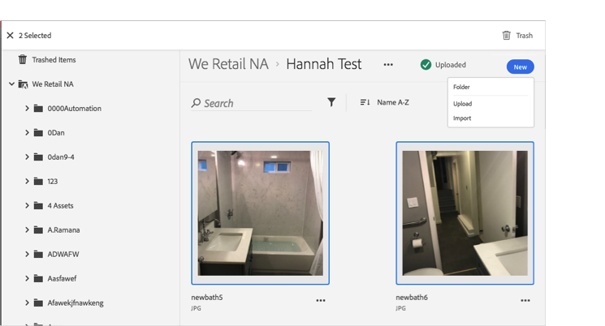

# Löschen eines Assets{#trash-an-asset}

Sie können ein Asset in der Adobe Experience Cloud-Bibliothek löschen, um es aus der Bibliothek zu entfernen.

So löschen Sie ein Asset in der Experience Cloud-Bibliothek:

1. Klicken Sie auf ein oder mehrere Assets, die Sie löschen möchten. 

1. Klicken Sie oben auf der Seite auf das **[!UICONTROL Papierkorbsymbol]**.

