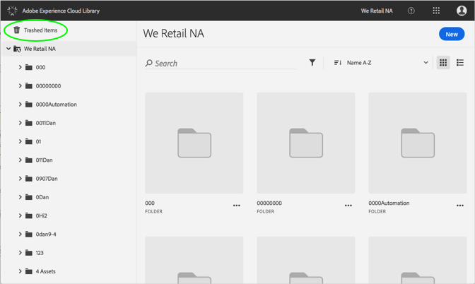
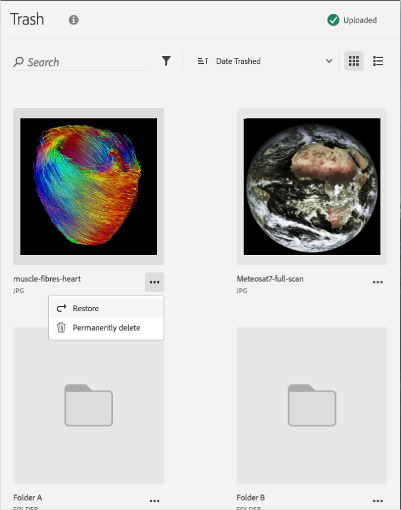

# Wiederherstellen eines gelöschten Assets{#restore-a-trashed-asset}

Sie können ein in der Adobe Experience Cloud-Bibliothek gelöschtes Asset wiederherstellen.

Wenn Sie ein Element löschen, wird es in der Experience Cloud-Bibliothek 60 Tage lang im Bereich „Gelöschte Elemente“ aufbewahrt. Wenn Sie diese Elemente nicht wiederherstellen, werden sie von der Experience Cloud-Bibliothek nach 60 Tagen permanent gelöscht.

So stellen Sie ein gelöschtes Assets vor Ablauf von 60 Tagen wieder her:

1. Klicken Sie auf **[!UICONTROL Gelöschte Elemente]**.

   

1. Klicken Sie auf ein oder mehrere Elemente, die wiederhergestellt werden sollen.
1. Klicken Sie auf **[!UICONTROL Mehr Info > Wiederherstellen]**.

   

1. Bestätigen Sie, dass Sie die ausgewählten Assets wiederherstellen möchten.

Am oberen Seitenrand wird die Wiederherstellung des Assets bestätigt.
