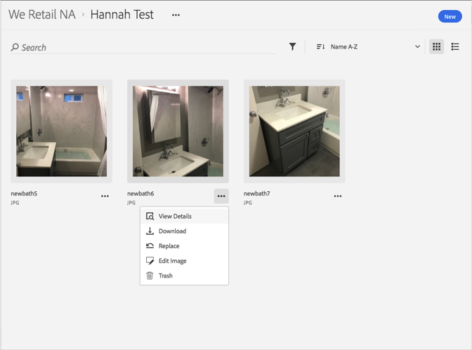

# Herunterladen eines Assets{#download-an-asset}

Sie können ein Asset in der Adobe Experience Cloud-Bibliothek herunterladen.

1. Klicken Sie auf ein Asset.
1. Klicken Sie auf das Menü **[!UICONTROL Mehr Optionen]** (drei Punkte) neben dem Asset.

   

1. Klicken Sie auf **[!UICONTROL Herunterladen]**, um das Asset herunterzuladen.

