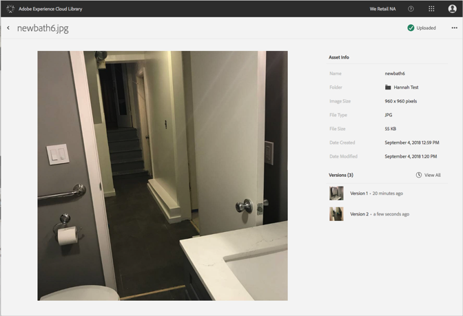

# Zurück zu einer älteren Version eines Assets{#revert-to-an-older-version-of-an-asset}

Sie können in der Adobe Experience Cloud-Bibliothek zu einer älteren Version eines Assets zurückkehren.

So kehren Sie zu einer älteren Version eines Assets in der Experience Cloud-Bibliothek zurück:

1. Klicken Sie auf ein Asset.
1. Klicken Sie auf das Menü **[!UICONTROL Mehr Optionen]** (Auslassungszeichen) neben dem Asset.

   

1. Klicken **[!UICONTROL Sie auf Asset-Details]**.
1. Klicken **[!UICONTROL Sie]** neben Versionen auf Alle anzeigen, um alle Versionen des Assets anzuzeigen.

   

1. Klicken Sie in der Liste der Versionen neben der Version, die Sie wiederherstellen möchten, auf das Menü **[!UICONTROL "Weitere Optionen"]** (Auslassungszeichen).

   

1. Klicken Sie auf **[!UICONTROL "Wiederherstellen]**«.

Die Version, auf die Sie zurückgekehrt sind, wird zu den aktuellen Versionen.
