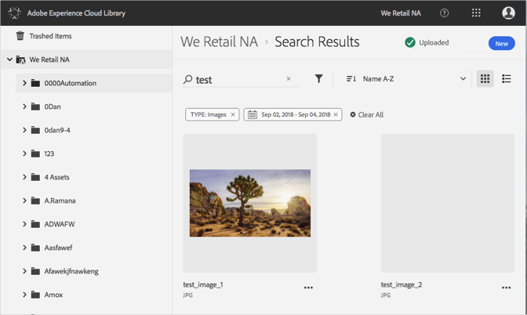

# Suche nach Assets{#search-for-assets}

Suchen Sie in der Adobe Experience Cloud-Bibliothek nach Assets, um Assets in der gesamten Organisation oder in einem bestimmten Ordner zu finden.

Suchen Sie in der Experience Cloud-Bibliothek nach Assets, indem Sie die Suchleiste verwenden. Die Suche durchsucht Dateinamen.

