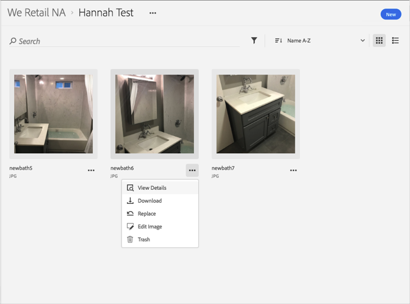

# Anzeige detaillierter Informationen zu einem Asset{#view-detailed-information-for-an-asset}

Anzeige detaillierter Informationen zu Assets in der Adobe Experience Cloud-Bibliothek, einschließlich Versionen.

So zeigen Sie in der Experience Cloud-Bibliothek detaillierte Informationen zu Assets, einschließlich Versionen, an:

1. Klicken Sie auf ein Asset.
1. Klicken Sie auf das Menü **[!UICONTROL Mehr Optionen]** (drei Punkte) neben dem Asset.

   

1. Klicken Sie auf **[!UICONTROL Details anzeigen]**, um weitere Details zu einem Asset anzuzeigen.

   

