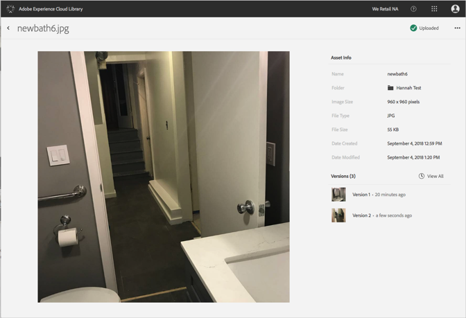

# Anzeige früherer Versionen eines Assets{#view-previous-versions-of-an-asset}

Sie können frühere Versionen eines Assets in der Adobe Experience Cloud-Bibliothek anzeigen.

So zeigen Sie frühere Versionen eines Assets in der Experience Cloud-Bibliothek an:

1. Wählen Sie ein Asset aus.
1. Wählen Sie das Menü **[!UICONTROL Mehr Optionen]** (drei Punkte) neben dem Asset aus.

   

1. Wählen Sie **[!UICONTROL Asset-Details]** aus.
1. Wählen Sie **[!UICONTROL Alle anzeigen]** neben den Versionen aus, um alle Versionen des Assets anzuzeigen.

   

