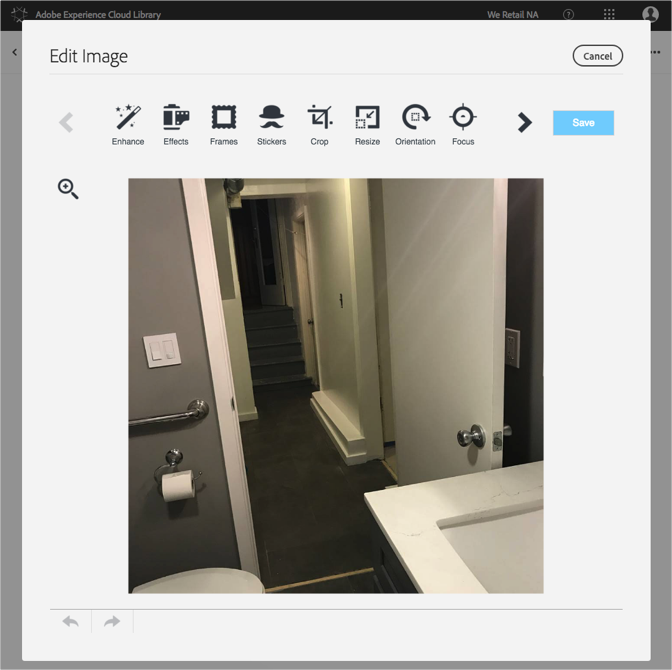

# Bearbeiten eines Bildes{#edit-an-image}

Verwenden Sie den in Adobe Experience Cloud Library integrierten Bild-Editor, um ein Bild direkt aus der Bibliothek zu bearbeiten.

So bearbeiten Sie ein Bild aus der Experience Cloud-Bibliothek

1. Klicken Sie auf ein Bild, um es zu bearbeiten.
1. Klicken Sie auf Bild bearbeiten. Wenn Sie das Bild speichern, wird es als neue Version gespeichert.

   Der Bildeditor wird geöffnet und Sie können das Bild bearbeiten.

   

