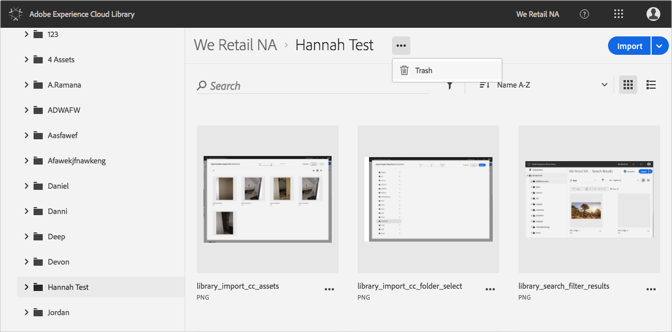
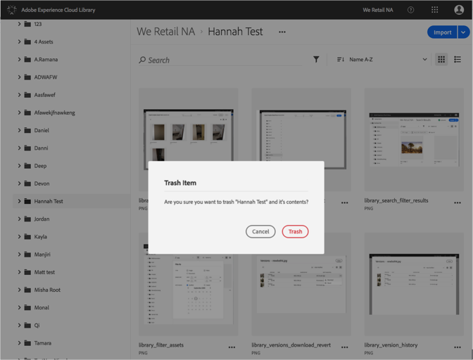

# Löschen eines Ordners{#trash-a-folder}

Sie können einen Ordner in der Adobe Experience Cloud-Bibliothek löschen.

So löschen Sie einen Ordner in der Experience Cloud-Bibliothek:

1. Klicken Sie auf den Ordner, der gelöscht werden soll.
1. Klicken Sie auf das Menü **[!UICONTROL Mehr Optionen]** (drei Punkte) und wählen Sie **[!UICONTROL Löschen]** aus.

   

1. Bestätigen Sie, dass Sie den Ordner löschen möchten.

   

