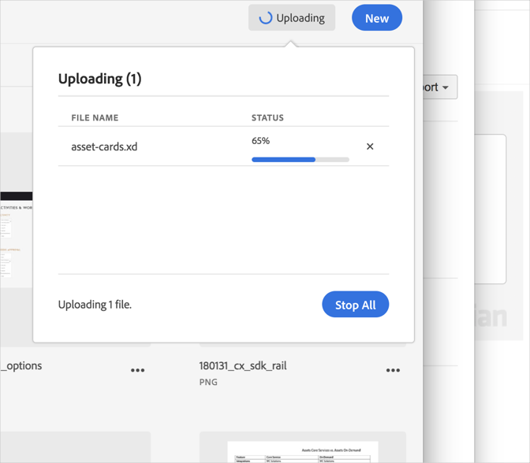

# Abbrechen eines Uploads{#cancel-an-upload}

Sie können einen Upload von Ihrem Gerät in die Adobe Experience Cloud-Bibliothek abbrechen, wenn Sie eine falsche oder zu große Datei ausgewählt haben.

So brechen Sie einen bereits gestarteten Upload ab:

1. Klicken Sie auf die Benachrichtigungsanzeige.
1. Klicken Sie auf **[!UICONTROL Alle anhalten]**, um alle Downloads zu stoppen, oder klicken Sie auf das **[!UICONTROL X]** neben den einzelnen Dateien, deren Upload abgebrochen werden soll.

   

Wenn Sie eine oder mehrere Dateien mit demselben Namen auswählen, fordert Sie die Experience Cloud-Bibliothek auf, die alte Version zu ersetzen oder die neue zu behalten.
