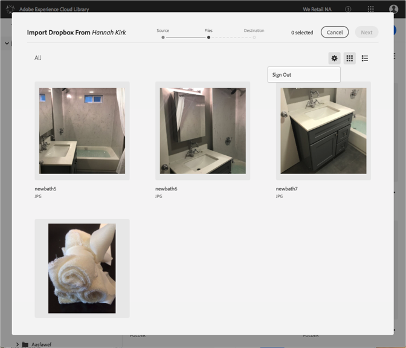

# Dropbox- oder Creative Cloud-Konten ändern{#change-dropbox-or-creative-cloud-accounts}

Wechseln Sie zu einem anderen Dropbox- oder Creative Cloud-Konto, um Inhalte der Adobe Experience Cloud-Bibliothek hinzuzufügen.

Wenn Sie sich bei einem Dropbox- oder Creative Cloud-Konto angemeldet haben, bleiben Sie angemeldet, es sei denn, Sie melden sich ab oder wechseln Konten.

So wechseln Sie zu einem anderen Dropbox- oder Creative Cloud-Konto:

1. Wählen Sie **[!UICONTROL "Neu]** " &gt;" **[!UICONTROL Importieren]**«.

   

1. Wählen **[!UICONTROL Sie Creative Cloud]** oder **[!UICONTROL Dropbox]** aus.

   

1. Wählen Sie **[!UICONTROL "Weiter]**«.
1. Wählen Sie das Zahnradsymbol in der oberen rechten Ecke aus.

   

1. Wählen **[!UICONTROL Sie Abmelden]**.
1. Melden Sie sich bei dem anderen Konto an.

