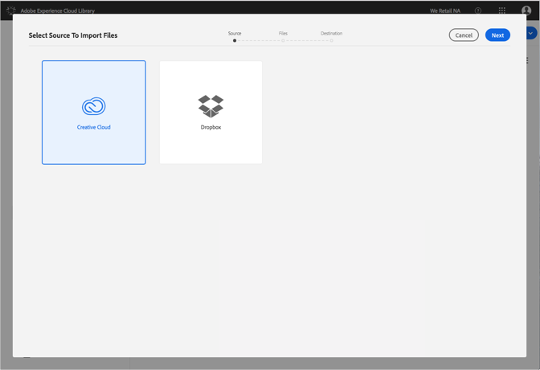

# Ändern von Dropbox- oder Creative Cloud-Konten{#change-dropbox-or-creative-cloud-accounts}

Sie können zu einem anderen Dropbox- oder Creative Cloud-Konto wechseln, um Inhalt zur Adobe Experience Cloud-Bibliothek hinzuzufügen.

Wenn Sie sich bei einem Dropbox- oder Creative Cloud-Konto angemeldet haben, bleiben Sie angemeldet, es sei denn, Sie melden sich ab oder wechseln das Konto.

So wechseln Sie zu einem anderen Dropbox- oder Creative Cloud-Konto:

1. Auswählen **[!UICONTROL Neu]** > **[!UICONTROL Import]**.

   

1. Wählen Sie **[!UICONTROL Creative Cloud]** oder **[!UICONTROL Dropbox]** aus.

   

1. Klicken Sie auf **[!UICONTROL Weiter]**.
1. Wählen Sie das Zahnradsymbol in der oberen rechten Ecke aus.

   

1. Wählen Sie **[!UICONTROL Abmelden]** aus.
1. Melden Sie sich bei dem anderen Konto an.

