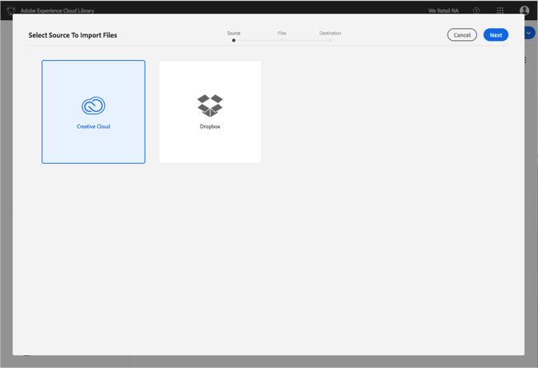
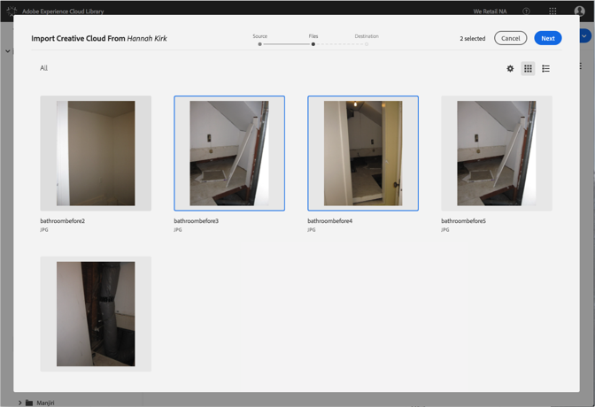
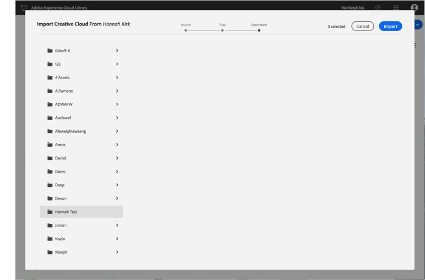

# Importieren von Creative Cloud-Dateien in die Adobe Experience Cloud-Bibliothek{#import-creative-cloud-files-into-the-adobe-experience-cloud-library}

Importieren Sie Dateien aus der Creative Cloud in die Adobe Experience Cloud-Bibliothek, um sie aus einem beliebigen Adobe Experience Cloud-Produkt zu verwalten.

>[!NOTE]
>
>Bevor Sie diese Aufgabe durchführen können, müssen Sie einen Ordner erstellen.

So importieren Sie Creative Cloud-Dateien in die Experience Cloud-Bibliothek:

1. Wählen Sie **[!UICONTROL "Neu]** " &gt;" **[!UICONTROL Importieren]**«.

   

1. Wählen **[!UICONTROL Sie Creative Cloud]**.

   Melden Sie sich bei Ihrem Creative Cloud-Konto an, falls Sie es noch nicht getan haben.

   

1. Click **[!UICONTROL Next]**.
1. Wählen Sie eine oder mehrere zu importierende Dateien aus.

   

1. Click **[!UICONTROL Next]**.
1. Wählen Sie den Ordner aus, in dem die Assets platziert werden sollen.

   >[!NOTE]
   >
   >Sie können einen Ordner auswählen, in dem die Assets importiert werden sollen. Um Dateien in verschiedenen Ordnern zu platzieren, wiederholen Sie diese Aufgabe für jeden Ordner.

   

1. Click **[!UICONTROL Import]**.

