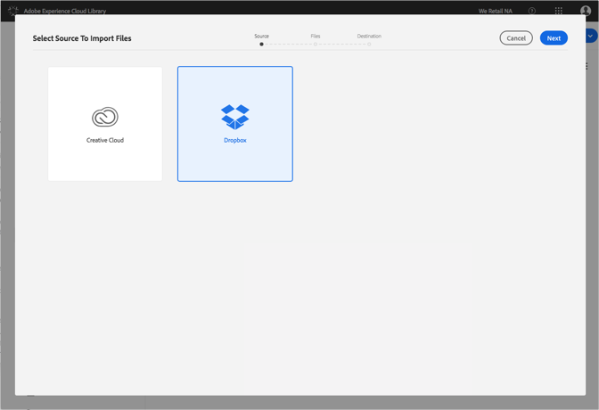
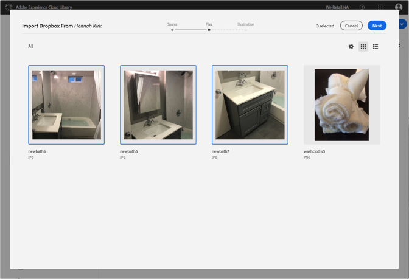
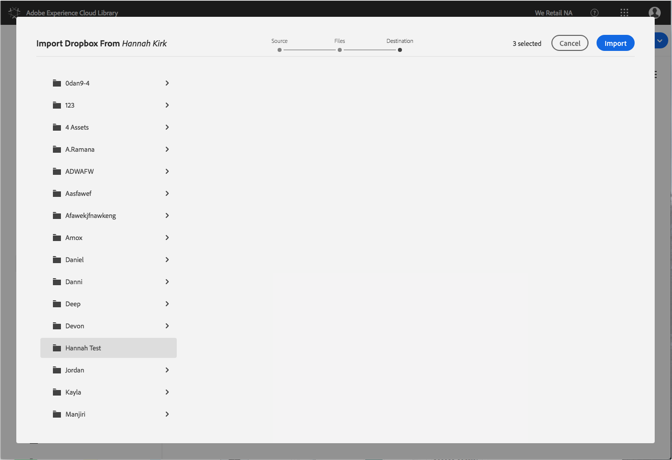

# Importieren von Dropbox-Dateien in die Adobe Experience Cloud-Bibliothek{#import-dropbox-files-into-the-adobe-experience-cloud-library}

Sie können Dateien aus Dropbox in die Adobe Experience Cloud-Bibliothek importieren, um sie in einem beliebigen Adobe Experience Cloud-Produkt zu verwalten.

>[!NOTE]
>
>Bevor Sie diese Aufgabe durchführen können, müssen Sie einen Ordner erstellen.

So importieren Sie Dropbox-Dateien in die Experience Cloud-Bibliothek:

1. Select **[!UICONTROL New]** > **[!UICONTROL Import]**.

   

1. Wählen Sie **[!UICONTROL Dropbox]** aus.

   Melden Sie sich bei Ihrem Dropbox-Konto an, falls Sie das noch nicht getan haben.

   

1. Klicken Sie auf **[!UICONTROL Weiter]**.
1. Wählen Sie eine oder mehrere zu importierende Dateien aus.

   

1. Klicken Sie auf **[!UICONTROL Weiter]**.
1. Wählen Sie den Ordner aus, in den die Assets abgelegt werden sollen.

   >[!NOTE]
   >
   >Sie können nur einen Ordner auswählen, in dem die Assets importiert werden sollen. Um Dateien in verschiedenen Ordnern abzulegen, müssen Sie diesen Schritt für jeden Ordner wiederholen.

   

1. Klicken Sie auf **[!UICONTROL Importieren]**.

