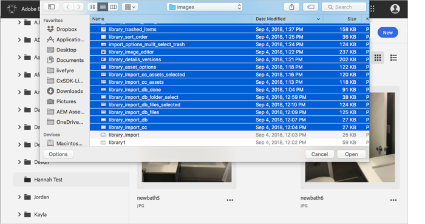
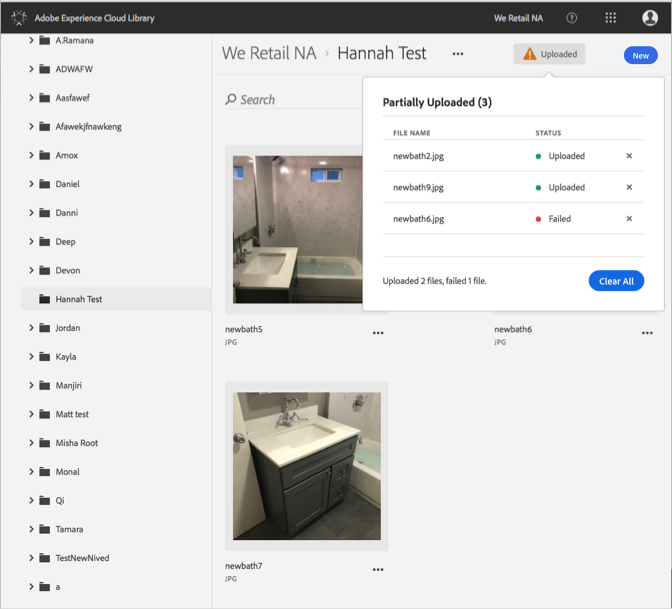

# Hochladen von Assets vom Gerät{#upload-asset-from-device}

Sie können Assets von Ihrem Gerät hochladen, um sie in der Adobe Experience Cloud-Bibliothek zu verwalten.

So laden Sie Assets von Ihrem Gerät in die Experience Cloud-Bibliothek hoch:

1. Wählen Sie **[!UICONTROL Neu]** > **[!UICONTROL Hochladen]**.

   

1. Wählen Sie die Assets aus, die in die Experience Cloud-Bibliothek hochgeladen werden sollen.

   

1. Wenn Ihre Dateien hochgeladen wurden, wird eine Bestätigung oder Fehlermeldung im Benachrichtigungsfeld angezeigt.

   

